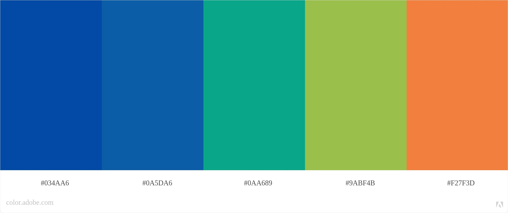

# Rick and Morty - Who's this mysterious character?

O objetivo deste projeto é criar uma aplicação web que exibe um conjunto de dados sobre a série. O site permite a visualização, bem como filtrar, ordenar e obter informações estatísticas sobre os personagens da animação. 

## Índice

- [1. Introdução](#1-introdução)
- [2. Histórias de usuários](#2-histórias-de-usuários)
- [3. Desenvolvimento de layout](#3-desenvolvimento-de-layout)
- [4. Testes de usuabilidade](#4-testes-de-usuabilidade)
- [5. Objetivos de aprendizagem](#5-objetivos-de-aprendizagem)
- [6. Tecnologias utilizadas](#6-tecnologias-utilizadas)
- 
---

## 📚 1. Introdução

Em 2013, foi lançada <b>Rick and Morty</b>. A série de animação adulta conta as aventuras repletas de ficção científica e comédia de Rick e seu neto não muito brilhante, o Morty. A série é americana e tem sido exibida em várias regiões do mundo, possui boas críticas nos principais sites de avaliação. 
Rick and Morty se originou de uma paródia animada em curta metragem do filme <b>De volta para o futuro</b>.

## 📃 2. Histórias de usuários

1º História: para fãs da série

Foi definido que seria relevante ter funcionalidades que pudessem entregar informações sobre o status dos personagens, se ele está vivo ou morto na história. A série contém um número elevado de personagens e os fãs gostariam de obter esse dado. 

2º História: para interessados em ficção científica

Foi definido que seria relevante ter funcionalidades que pudessem entregar informações sobre as espécies e a origem dos personagens, pois esses são temas relacionados à ficção científica. 

## 💡  3. Desenvolvimento de layout

### Protótipo de baixa fidelidade

### Paleta de cores

Escolhemos a paleta de cores com base em uma imagem da série. As cores mais utilizadas foram: 

  

 

### Interface

* ### Desktop

  

 

* ### Responsivo

  

 

## 📱 4. Testes de usabilidade 
O nosso formulário de usabilidade está [aqui.](https://docs.google.com/forms/d/e/1FAIpQLSckY4mi6UL2kKKzzaLvGrMUj-iHYRhPKHg17EGmF9RlWgR9KA/viewform)

As sugestões de alterações enviadas pelos usuários por meio do formulário foram:

1. Diminuir a margem entre as logos do site e o início da página;

2. Incluir o botão "Limpar filtro";

3. Ajustar o tamanho dos cards na versão mobile;

4. Aumentar o tamanho da fonte nas informações sobre os personagens;

Todas as alterações foram executadas.

## 🏆  5. Objetivos de aprendizagem

### HTML e CSS

- [Uso de HTML semântico.](https://developer.mozilla.org/en-US/docs/Glossary/Semantics#Semantics_in_HTML)
-  Uso de seletores de CSS.
-  Construir sua aplicação respeitando o desenho realizado (protótipo).
- [Uso de flexbox em CSS.](https://css-tricks.com/snippets/css/a-guide-to-flexbox/)

### DOM e Web APIs

-  Uso de seletores de DOM.
-  Gerenciamento de eventos de DOM.
-  [Manipulação dinâmica de DOM.](https://developer.mozilla.org/pt-BR/docs/DOM/Referencia_do_DOM/Introdu%C3%A7%C3%A3o) (appendChild |createElement | createTextNode| innerHTML | textContent | etc.)

### JavaScript

-  Uso de condicionais (if-else | switch | operador ternário)
-  Uso de laços (for | for..in | for..of | while)
-  Uso de funções (parâmetros | argumentos | valor de retorno)
-  Manipular arrays (filter | map | sort | reduce)
-  Manipular objects (key | value)
-  Uso ES modules ([`import`](https://developer.mozilla.org/en-US/docs/Web/JavaScript/Reference/Statements/import) | [`export`](https://developer.mozilla.org/en-US/docs/Web/JavaScript/Reference/Statements/export))
-  Diferenciar entre expression e statements.
-  Diferenciar entre tipos de dados atômicos e estruturados.

### Testing

-  [Teste unitário.](https://jestjs.io/docs/pt-BR/getting-started)

### Estrutura do código e guia de estilo

-  Organizar e dividir o código em módulos (Modularização)
-  Uso de identificadores descritivos (Nomenclatura | Semântica)
-  Uso de linter (ESLINT)

### Git e GitHub

-  Uso de comandos de git (add | commit | pull | status | push)
-  Gerenciar repositórios de GitHub (clone | fork | gh-pages)
-  Colaboração no Github (branches | pull requests | |tags)
 

## 🚀 6. Tecnologias Utilizadas
 

 

 Linguagem de marcação 

  

 Linguagem de estilização

 

 Linguagem de programação interpretada estrutura

  

 Sistemas de controle de versões distribuídos

---
## 👩‍💻 Colaboradoras 

<table>
  <tr>
      <td align="center">
            <a href="#">
             
            
            <b>Bruna Calixto</b> 
            
            </a>
      </td>
    <td align="center">
      <a href="#">
         
        
          <b>Carmen Gozza</b> 
        
      </a>
    </td>
   
  </tr>
</table>

<table width="300">
      <td>
            <a href="https://github.com/bruna-devbio/">
            <a href="https://www.linkedin.com/in/brunacalixtodevjunior/">
      </td>
      <td>
            <a href="https://github.com/carmemilya">
            <a href="https://www.linkedin.com/in/carmen-emilia-gozza/">
      </td>

</table>

